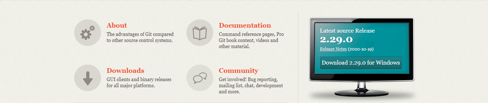
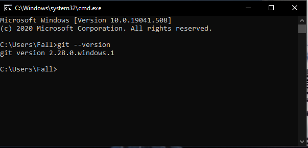
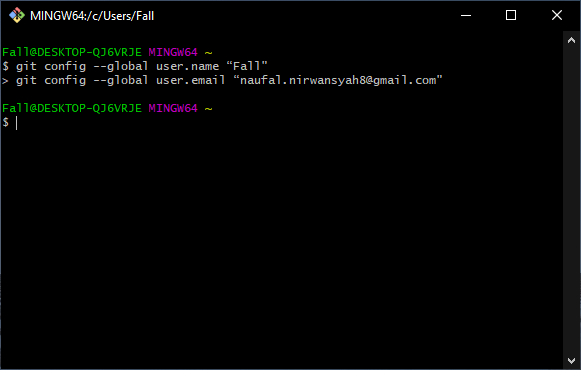
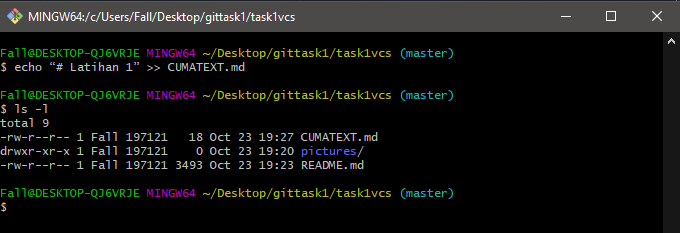

# Apa itu VCS
• VCS atau Version Control System merupakan sebuah sistem yang
merekam perubahan-perubahan dari sebuah berkas atau sekumpulan
berkas dari waktu ke waktu sehingga Anda dapat melihat kembali
setiap perubahannya.  
• Salah satu DVCS (Distributed Version Control System) yang sangat
populer saat ini adalah git. 

# Apa itu Git?
• Git adalah salah satu sistem pengontrol versi (Version Control
System) pada proyek perangkat lunak yang diciptakan oleh Linus
Torvalds.
• Pengontrol versi bertugas mencatat setiap perubahan pada file
proyek yang dikerjakan oleh banyak orang maupun sendiri.
• Git dikenal juga dengan distributed revision control (VCS terdistribusi),
artinya penyimpanan database Git tidak hanya berada dalam satu
tempat saja.

# Instalasi Git
• Download Git, buka website resminya : [Git Link](https://git-scm.com)
 
 
 
• Kemudian unduh Git sesuai dengan arsitektur komputer kita. Kalau menggunakan 64bit, unduh yang 64bit. Begitu juga kalau menggunakan 32bit. 
• Selamat, Git sudah terinstal di Windows. Untuk mencobanya,
silahkan buka CMD atau PowerShell, kemudian ketik perintah :  
***--> git --version***  

# Menambahkan Global Config
• Pada saat pertama kali menggunakan git, perlu dilakukan konfigurasi *user.name dan user.email*
 
• Konfigurasi ini bisa dilakukan untuk global repostiry atau individual repository.
 
• Apabila belum dilakukan konfigurasi, akan mengakibatkan terjadi kegagalan saat menjalankan perintah git commit
 
• Config Global Repository 
***--> git config --global user.name “nama_user”*** 
***--> git config --global user.email “nama_user”*** 

# Perintah Dasar Git
• **git init**, Perintah untuk membuat repository local 
• **git add**, Perintah untuk menambahkan file baru, atau perubahan pada file pada staging sebelum proses commit. 
• **git commit**, Perintah untuk menyimpan perubahan kedalam database git.  
• **git push -u origin master**, Perintah untuk mengirim perubahan pada repository local menuju server repository. 
• **git clone [url]**, Perintah untuk membuat working directory yang diambil dari repositry sever. 
• **git remote add origin [url]**, Perintah untuk menambahkan remote server/reopsitory server pada local repositry (working directory) 
• **git pull**, Perintah untuk mengambil/mendownload perubahan terbaru dari server repository ke local repository

# Membuat Reposiory Local
• Buka direktory aktif, misal: C:\Users\Fall\Desktop\gittask1 (buka menggunakan Windows Explorer)  
• klik kanan pada direktory aktif tersebut, dan pilih menu Git Bash, sehingga muncul git bash command.  
• Buat direktory project praktikum pertama dengan nama gittask1.  
• Sehingga terbentuk satu direktori baru dibawahnya, selanjutnya masuk kedalam direktori tersebut dengan perintah cd (change directory) direktory aktif menjadi: **C:\Users\Fall\Desktop\gittask1**

# Membuat Reposiory Local
• Jalankan perintah git init, untuk membuat repository local. 
**$ git init** 

 
• Repository baru berhasil di inisialisasi, dengan terbentuknya satu direktori hidden dengan nama **.git**  
• Pada direktori tersebut, semua perubahan pada working directory akan disimpan.

# Menambahkan File baru pada repository
• Untuk membuat file dapat menggunakan text editor, lalu menyimpan filenya pada direktori aktif (repository) 
**$ echo “# Latihan 1” >> CUMATEXT.md**
• Disini kita akan coba buat satu file bernama CUMATEXT.md (text file)
• File CUMATEXT.md berhasil dibuat.  
