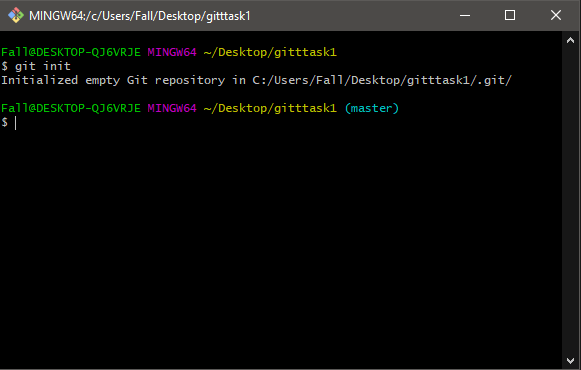

# Apa itu VCS
• VCS atau Version Control System merupakan sebuah sistem yang
merekam perubahan-perubahan dari sebuah berkas atau sekumpulan
berkas dari waktu ke waktu sehingga Anda dapat melihat kembali
setiap perubahannya.  
• Salah satu DVCS (Distributed Version Control System) yang sangat
populer saat ini adalah git. 

# Apa itu Git?
• Git adalah salah satu sistem pengontrol versi (Version Control
System) pada proyek perangkat lunak yang diciptakan oleh Linus
Torvalds.
• Pengontrol versi bertugas mencatat setiap perubahan pada file
proyek yang dikerjakan oleh banyak orang maupun sendiri.
• Git dikenal juga dengan distributed revision control (VCS terdistribusi),
artinya penyimpanan database Git tidak hanya berada dalam satu
tempat saja.

# Instalasi Git
• Download Git, buka website resminya : [Git Link](https://git-scm.com)
 
 
 
• Kemudian unduh Git sesuai dengan arsitektur komputer kita. Kalau menggunakan 64bit, unduh yang 64bit. Begitu juga kalau menggunakan 32bit. 
• Selamat, Git sudah terinstal di Windows. Untuk mencobanya,
silahkan buka CMD atau PowerShell, kemudian ketik perintah :  
***--> git --version***  

# Menambahkan Global Config
• Pada saat pertama kali menggunakan git, perlu dilakukan konfigurasi *user.name dan user.email*
 
• Konfigurasi ini bisa dilakukan untuk global repostiry atau individual repository.
 
• Apabila belum dilakukan konfigurasi, akan mengakibatkan terjadi kegagalan saat menjalankan perintah git commit
 
• Config Global Repository  
***--> git config --global user.name “nama_user”***  
***--> git config --global user.email “nama_user”***  

# Perintah Dasar Git
• **git init**, Perintah untuk membuat repository local 
• **git add**, Perintah untuk menambahkan file baru, atau perubahan pada file pada staging sebelum proses commit. 
• **git commit**, Perintah untuk menyimpan perubahan kedalam database git.  
• **git push -u origin master**, Perintah untuk mengirim perubahan pada repository local menuju server repository. 
• **git clone [url]**, Perintah untuk membuat working directory yang diambil dari repositry sever.
 
• **git remote add origin [url]**, Perintah untuk menambahkan remote server/reopsitory server pada local repositry (working directory)
 
• **git pull**, Perintah untuk mengambil/mendownload perubahan terbaru dari server repository ke local repository

# Membuat Reposiory Local
 
• Buka direktory aktif, misal: C:\Users\Fall\Desktop\gittask1 (buka menggunakan Windows Explorer) 
 
• klik kanan pada direktory aktif tersebut, dan pilih menu Git Bash, sehingga muncul git bash command. 
 
• Buat direktory project praktikum pertama dengan nama gittask1. 
 
• Sehingga terbentuk satu direktori baru dibawahnya, selanjutnya masuk kedalam direktori tersebut dengan perintah cd (change directory) direktory aktif menjadi: **C:\Users\Fall\Desktop\gittask1**

# Membuat Reposiory Local
 • Jalankan perintah git init, untuk membuat repository local.
 
**$ git init** 

 
• Repository baru berhasil di inisialisasi, dengan terbentuknya satu direktori hidden dengan nama **.git**  
 
• Pada direktori tersebut, semua perubahan pada working directory akan disimpan.

# Menambahkan File baru pada repository
 
• Untuk membuat file dapat menggunakan text editor, lalu menyimpan filenya pada direktori aktif (repository)

**$ echo “# Latihan 1” >> CUMATEXT.md**
 
• Disini kita akan coba buat satu file bernama CUMATEXT.md (text file) 
 
• File CUMATEXT.md berhasil dibuat.  

# Menambahkan File baru pada repository
• Untuk menambahkan file yang baru saja dibuat tersebut gunakan perintah **git add** 
 
 
• Jangan lupa untuk melakukan commit dan push ke remote origin anda.

***Maka file README.md berhasil ditambahkan kedalam repository anda!***

# Commit (Menyimpan perubahan ke database)
• Untuk menyimpan perubahan yang ada kedalam database repository local, gunakan perintah git commit -m “komentar commit” 
**$ git commit -m “add note”**  
 
• Perubahan berhasil disimpan.

# Membuat Repository Server (Github)
• Server reopsitory yang akan kita gunakan adalah [Github](http://github.com)  
• Anda harus membuat akun terlebih dahulu. 
• Pada laman github, klik tombol start a project, atau Dari menu **(icon +)** klik **New Repository**
 
• Kemudian silahkan anda liat sampel berikut. 
 
• Setelah selesai klik **Create Repository**  
**Selamat anda telah berhasil membuat Repo Server yang bisa dihubungkan dengan Repo lokal di dekstop kalian!**

# Menambahkan Remote Repository
• Remote Repository merupakan repository server yang akan digunakan untuk menyimpan setiap perubahan pada local repository, sehingga dapat diakses oleh banyak user. 
• Untuk menambahkan remote repository server, gunakan perintah git remote add origin [url] 
Sampel dari saya -> :  
**$ git remote add origin https://github.com/logy8th/task1vcs**  
• Setelah sukses anda bisa *clone* / *push* repo anda yang terdapat di Server tersebut.

# Push (Mengirim perubahan ke server)
• Untuk mengirim perubahan pada local repository ke server gunakan perintah **git push**. 
• Perintah ini akan meminta memasukkan username dan password pada akun **github.com** kalian.  
 
• Jika result seperti gambar diatas maka perubahan sudah dilakukan di server kalian

# Melihat hasilnya pada server repository
• Buka laman github.com milik anda, kemudian arahkan pada repositori yang anda hubungkan dengan repo lokal anda tadi. 
• Maka perubahan akan terlihat pada laman tersebut.

# Clone Repository
• Clone repository, pada dasarnya adalah meng-copy repository server dan secara otomatis membuat satu direktory sesuai dengan nama repositorynya (working directory). 
• Untuk melakukan cloning, gunakan perintah **git clone [url]** 
 
• Jika result seperti gambar diatas maka anda berhasil melakukan cloning dari repo server ke repo lokal anda.

# Kegunaan file README.md
• Apabila kita menggunakan github, untuk memberikan penjelasan awal pada project yang kita buat, maka dapat menggunakan sebuah file yang bernama **README.md** 
• Pada file tersebut kita dapat membuat dokumentasi awal dari setiap project yang kita buat untuk memberikan penjelasan atau sekedar cara penggunaan dari aplikasi yang kita kembangkan.
• Penulisan file README.md berbasis teks, dan untuk pemformatannya menggunakan Markdown format.
• untuk lebih jelasnya, dapat anda pelajari cara penggunaan markdown pada url berikut: [https://guides.github.com/features/masteringmarkdown/]